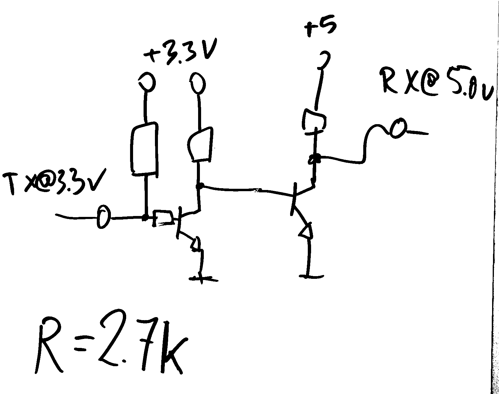

# wiring

arduino is connected to E32-433T20D LoRa module via level-shifter.
this is needed since arduino is operating at 5V, while LoRa module at 3.3V and is not 5V-tolerant.

additionally, LoRa module's `M0` and `M1` pins must be pulled low, in order for it to operate.
